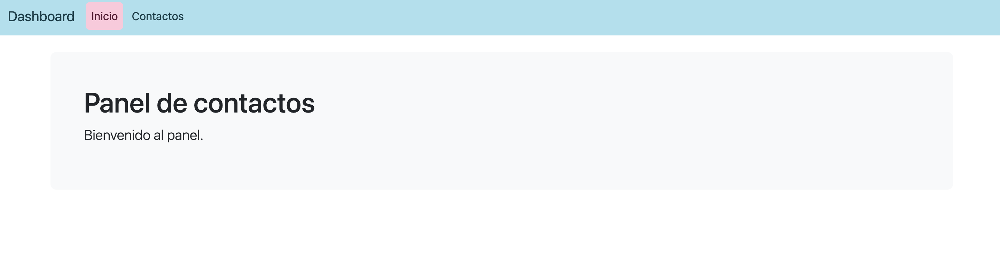
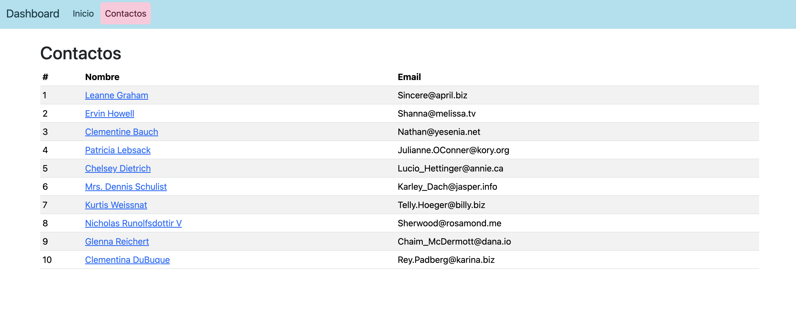
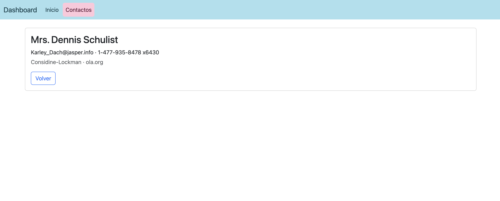

# Dashboard de Contactos - React + TypeScript

Panel de contactos hecho con **React**, **TypeScript** y **Bootstrap**, creado con **Vite**.
Es la misma práctica que el `dashboard-app` de Angular, ahora con React.

Taller de la materia **Programación Web en el Cliente**, UEES.
**Autora:** Paula Martillo Quintana

## Qué hace

Es una SPA con varias páginas (Inicio, Contactos, detalle de contacto y 404) y un menú de navegación.
La tabla de Bootstrap con los contactos (id, nombre y email) se carga desde una API REST
(`jsonplaceholder.typicode.com/users`), con mensajes de carga y de error. Al hacer clic en un nombre
se abre la página de detalle del contacto.

## Capturas

**Inicio (`/`)**: página de bienvenida con el menú; la página actual se resalta en rosa.



**Contactos (`/contactos`)**: tabla Bootstrap con los contactos que llegan de la API; cada nombre enlaza a su detalle.



**Detalle (`/contactos/:id`)**: tarjeta con email, teléfono, empresa y sitio web del contacto, y botón para volver.



## Estilo

Para darle más personalidad, personalicé el color de la barra de navegación en `src/index.css`,
con la misma paleta del Taller 4 (ArticulosCorp): fondo celeste `#a8e0ee`, texto petróleo `#0d3d48`
y la página activa marcada con una pastilla rosa `#ffc8db`. Se reutilizan las variables de
Bootstrap 5.3 (`--bs-navbar-*`) en lugar de sobrescribir sus clases.

## Tecnologías

- React 19 + TypeScript
- Vite
- Bootstrap 5
- React Router (paquete `react-router`)

## Estructura

```
src/
├── components/
│   ├── ContactList.tsx   # Pide los contactos al servicio y arma la tabla (carga / error / tabla)
│   ├── ContactRow.tsx    # Una fila por contacto, con enlace al detalle
│   └── Navbar.tsx        # Menú de navegación con NavLink
├── pages/
│   ├── HomePage.tsx          # Ruta /
│   ├── ContactsPage.tsx      # Ruta /contactos
│   ├── ContactDetailPage.tsx # Ruta /contactos/:id
│   └── NotFoundPage.tsx      # Cualquier otra ruta (*)
├── services/
│   └── contactsService.ts    # getContacts() y getContact(id) con fetch
├── types/
│   └── contact.ts        # Interfaces Contact y ContactDetail
├── App.tsx               # Navbar + definición de rutas
├── index.css             # Estilos globales: paleta celeste y rosa de la barra
└── main.tsx              # Punto de entrada: Bootstrap + BrowserRouter + <App />

img/                      # Capturas de pantalla usadas en este README
```

## Conceptos practicados

- **Componentes funcionales:** cada componente es una función que devuelve JSX.
- **Props:** `ContactList` le pasa cada contacto a `ContactRow` (`contact={contact}`), como un `input()` en Angular.
- **Listas con `map()` y `key`:** reemplaza al `@for (...; track contact.id)` de Angular.
- **Tipos con `import type`:** lo exige `verbatimModuleSyntax` en la plantilla de Vite.
- **Hooks:** `useState` para los datos, la carga y el error; `useEffect` para pedir datos al montar el componente.
- **Servicio con `fetch` + `async/await`:** el acceso a la API vive fuera de los componentes.
- **Renderizado condicional:** `if` con `return` anticipado para los estados de carga y error.
- **React Router:** `BrowserRouter`, `Routes`, `Route`, `Link`/`NavLink`, ruta dinámica `/contactos/:id` con `useParams()` y ruta `*` para el 404.

## Cómo ejecutarlo

```bash
npm install
npm run dev
```

Luego abre `http://localhost:5173` en el navegador.
